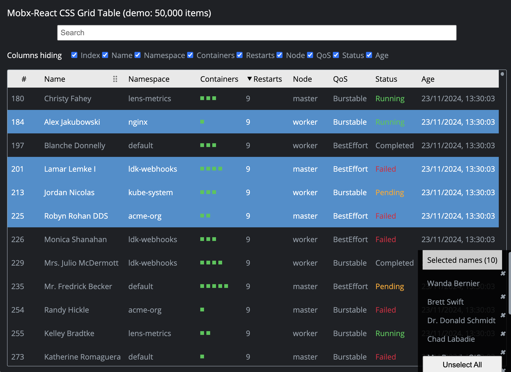

Powerful, simple, fast and API-friendly CSS-grid component (based on React/MobX) 
----

## Install | [npm](https://www.npmjs.com/package/mobx-react-table-grid)
```
npm install mobx-react-table-grid
```

## Benefits

- simple API _(just use as data input plain-objects and data-getters, mostly see `TableDataColumn` and `TableDataRow` interfaces)_
- table rows virtualization _(you can easily handle 50k+ items (e.g. k8s resources) without slowness in UI while having access to data)_
- most of the layout done via `display: grid` with some help of css-variables _(works really fast!)_ 
- multi-columns sorting _(powered by `lodash/orderBy`)_ 
- reordering columns: drag the heading column _(powered by `react-dnd`)_ 
- filtering columns _(show/hide/search)_ 
- resizing columns + reset to default (css-grid min-content)
- lightweight rows search implementation (see `demo.tsx`)
- rows/data selection state management (see `demo.tsx`)
- import/export grid-state to external storage (e.g. `window.localStorage`, see `demo.tsx`)
- customize column sizes via css-variables `--grid-col-size-${columnId}` _(see usage in `demo.module.css`)_
- `mobx` observability for grid state management under the hood

## Demo

```
git clone https://github.com/ixrock/mobx-react-table-grid.git
npm install
npm run dev
```




## Example

```tsx
import "mobx-react-table-grid/index.css"; // or @import in *.css 
import React from "react"
import { createRoot } from "react-dom/client" // react@18+
import { observer } from "mobx-react"
import { createTableState, Table } from "mobx-react-table-grid";

interface ResourceItem {
  id: string | number;
  name: string;
  hobby: string[];
  renderName(): React.ReactNode;
};

const tableState = createTableState<ResourceItem>({
  items: [
    {
      id: 1,
      name: "Joe",
      hobby: ["hacking", "martial-arts"],
      renderName(){ return <b>Joel White</b> },
    },
    {
      id: 2,
      name: "Ann",
      hobby: ["dancing"],
      renderName(){ return <b>Anna Dark</b> },
    }
  ],
  columns: [
    {
      id: "index",
      title: <b>#</b>,
      renderValue: (row, col) => row.index,
    },
    {
      id: ResourceColumnId.name,
      title: <>Name</>,
      renderValue: (row, col) => row.data.renderName(),
      sortValue: (row, col) => row.data.name,
    },
    {
      id: ResourceColumnId.hobby,
      title: <>Hobby</>,
      renderValue: (row, col) => <b>{row.data.hobby.join(", ")}</b>,
      sortValue: (row, col) => row.data.hobby.join(""),
      searchValue: (row, col) => row.data.hobby.join(" "),
    },
  ]
});

const Demo = observer(() => {
  const { tableColumns, searchResultTableRows } = tableState;
  return (
    <Table
      id="table-grid-demo"
      columns={tableColumns.get()}
      rows={searchResultTableRows.get()}
    />
  );
});

// react@18+
const appRootElem = document.getElementById("app");
createRoot(appRootElem).render(<Demo/>);
```
